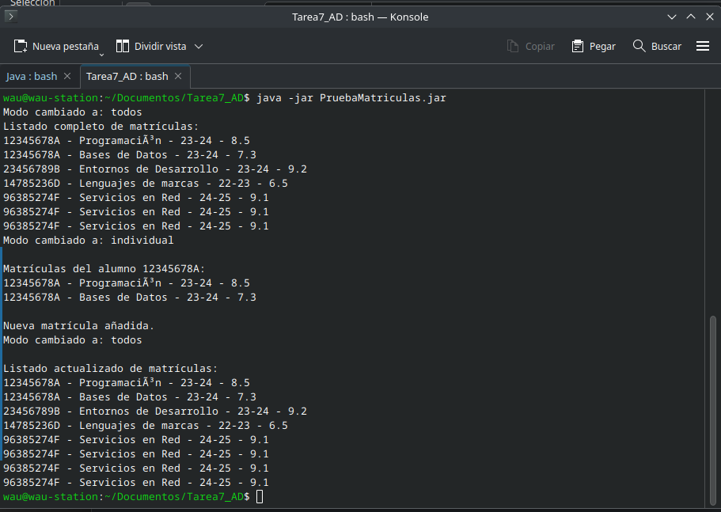

# Proyecto Tarea7_AD

Este proyecto contiene dos subproyectos que se encargan de gestionar y probar el sistema de matrículas.

## Estructura del Proyecto

```
Tarea7_AD/
│
├── Matriculas.jar          # Lógica del sistema de matrículas
├── PruebaMatriculas.jar    # Pruebas del sistema de matrículas
├── PruebaMatriculas        # Pruebas del sistema de matrículas
└── src/                    # Código fuente del proyecto
    └── PruebaMatriculas.java
└── src/                    # Código fuente del proyecto
    ├── GestorMatriculas.java
    ├── Matricula.java
    ├── ModoCambioEvent.java
    └── ModoCambioListener.java
```

## Clonar el Proyecto

Puedes clonar este proyecto desde GitHub utilizando el siguiente comando:

```bash
git clone https://github.com/alvarowau/Tarea7_AD.git
```
Esto descargará el proyecto completo en tu máquina local. Después, podrás compilar y ejecutar los diferentes subproyectos siguiendo las instrucciones proporcionadas en este README.

## Requisitos

- JDK 11 o superior.
- MySQL o base de datos compatible.

## Descripción

- **Matriculas.jar**: Este archivo JAR contiene la lógica del sistema de matrículas. Gestiona la creación, consulta y modificación de matrículas de alumnos.
  
- **PruebaMatriculas.jar**: Este archivo JAR se utiliza para probar el sistema de matrículas. Contiene ejemplos de cómo cargar, añadir y gestionar matrículas.

## Código Fuente

El código fuente está dividido en las siguientes clases:

- **GestorMatriculas.java**: Gestiona las operaciones sobre las matrículas, como cargar, añadir o seleccionar una matrícula específica.
- **Matricula.java**: Define el modelo de datos de una matrícula.
- **ModoCambioEvent.java**: Define el evento que se genera cuando el modo del sistema cambia.
- **ModoCambioListener.java**: Interfaz que permite escuchar los cambios de modo en el sistema.
- **PruebaMatriculas.java**: Realiza pruebas sobre el sistema de matrículas.

## Instrucciones para Ejecutar

### Opción 1: Usando Docker

1. **Configurar Docker**: En la raíz del proyecto, crea un archivo `docker-compose.yml` con el siguiente contenido:

```yaml
services:
  mysql:
    image: mysql:8.0
    container_name: mysql_server
    restart: always
    environment:
      MYSQL_ROOT_PASSWORD: root
    command: --default-authentication-plugin=mysql_native_password --character-set-server=utf8mb4 --collation-server=utf8mb4_general_ci
    ports:
      - "3306:3306"
    volumes:
      - mysql_data:/var/lib/mysql
      - ./init.sql:/docker-entrypoint-initdb.d/init.sql
    healthcheck:
      test: ["CMD", "mysqladmin", "ping", "-h", "localhost"]
      interval: 5s
      timeout: 10s
      retries: 5

volumes:
  mysql_data:
```

2. **Iniciar el contenedor**: Ejecuta el siguiente comando para iniciar el contenedor de Docker con la base de datos:

   ```bash
   docker-compose up
   ```

   Esto iniciará un contenedor de MySQL en el puerto 3306 y ejecutará el archivo `init.sql` para crear la base de datos, el usuario y las tablas necesarias.

3. **Verificar conexión**: Asegúrate de que la base de datos esté corriendo correctamente utilizando el siguiente comando:

   ```bash
   docker-compose ps
   ```

4. **Ejecutar el sistema de matrículas**:
   - Para ejecutar la lógica del sistema de matrículas, utiliza el archivo `Matriculas.jar`.

5. **Ejecutar las pruebas**:
   - Para ejecutar las pruebas, utiliza el archivo `PruebaMatriculas.jar`.

### Opción 2: Usando una Base de Datos Local

Si prefieres usar una base de datos local en lugar de Docker, puedes crear la base de datos manualmente utilizando el archivo `init.sql`. Este archivo contiene las instrucciones necesarias para crear las tablas y los datos iniciales en MySQL.

1. Conéctate a tu base de datos MySQL:
   ```bash
   mysql -u root -p
   ```

2. Ejecuta el contenido de `init.sql` para crear la base de datos y las tablas necesarias.

3. Asegúrate de que los detalles de la conexión a la base de datos en el código (usuario, contraseña, URL) coincidan con los configurados en tu servidor local.

## Prueba de Funcionamiento

A continuación se muestra una captura de pantalla que demuestra el funcionamiento del sistema de matrículas:



## Licencia

Este proyecto está bajo la licencia MIT.
